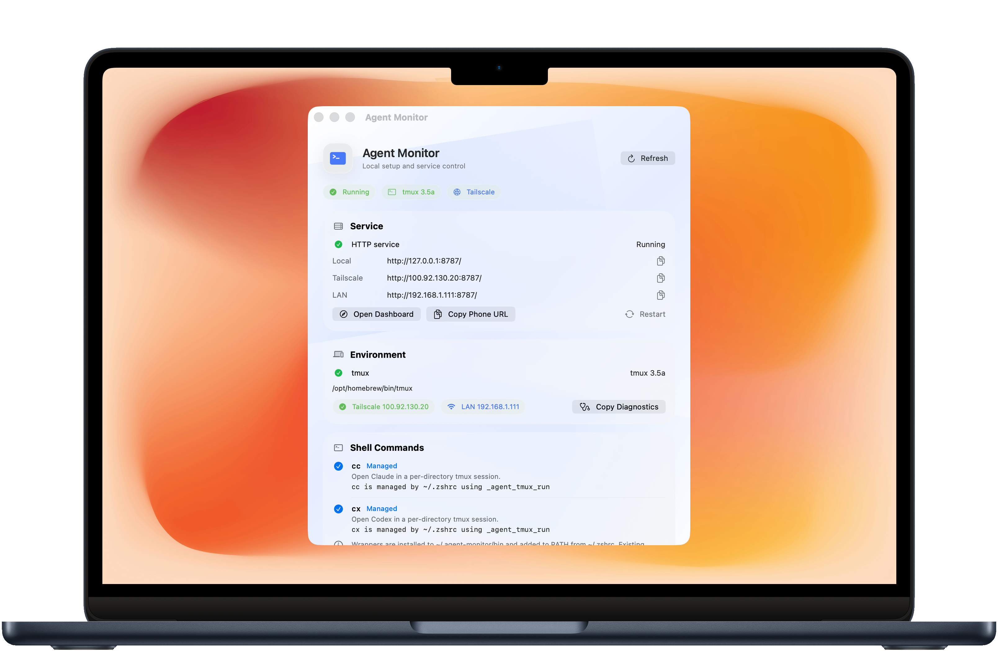
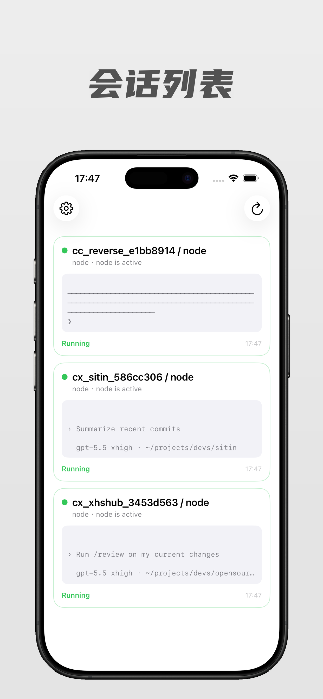
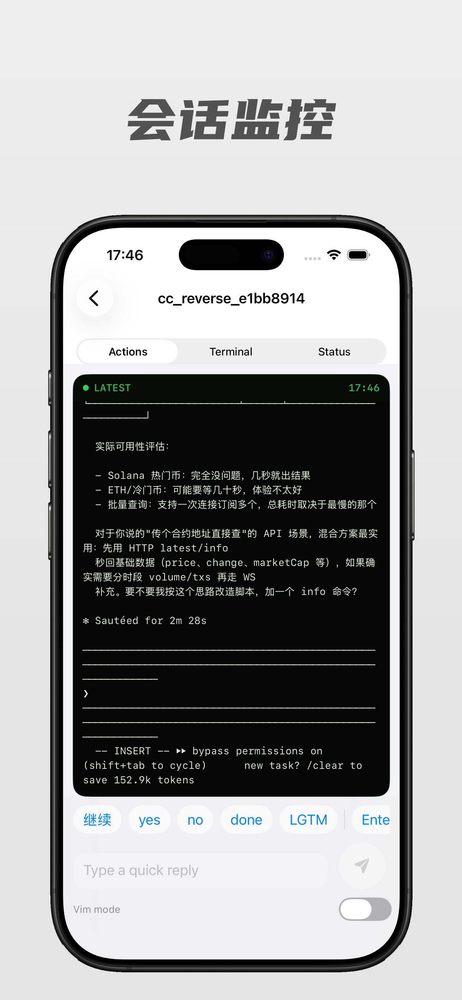
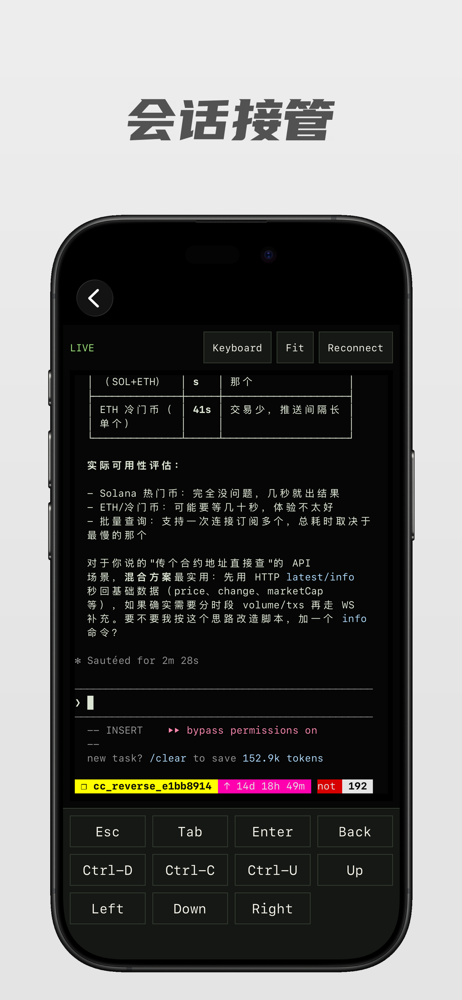

# Agent Monitor

iOS-first monitor and control surface for agent sessions running inside tmux across your Macs.

面向 iPhone 的本地优先多机器 Agent 工作控制台，用来查看家里电脑、随身 MacBook 等多台 Mac 上运行在 tmux 中的 Claude Code、Codex 等长任务会话，并在离开电脑后继续观察和接管上下文。

Agent Monitor is local-first. It is meant for localhost, a trusted LAN, or a private Tailscale tailnet. By default it does not require a token.

## Screenshots

<table>
  <tr>
    <td colspan="3"></td>
  </tr>
  <tr>
    <td></td>
    <td></td>
    <td></td>
  </tr>
</table>

## Requirements

- macOS or Linux with tmux
- Rust toolchain
- iOS app or macOS companion app for the client UI

## Repository Layout

```txt
.
├── scripts/             # LaunchAgent helpers for the Rust service
└── apps/apple/          # Apple apps and bundled Rust service
    └── AgentMonitorService/
```

## Start

```bash
cp .env.example .env
cargo run --manifest-path apps/apple/AgentMonitorService/Cargo.toml
```

Connect the iOS app to the printed service URL, usually through Tailscale or a trusted LAN. Add each Mac as a server profile in iOS Settings when you want one phone to watch multiple machines.

```bash
# Optional: require a token if you expose it beyond a trusted LAN.
AGENT_MONITOR_TOKEN=change-me cargo run --manifest-path apps/apple/AgentMonitorService/Cargo.toml
```

## Auto Start on macOS

Install the user LaunchAgent:

```bash
./scripts/install-launch-agent.sh
```

The service starts at login, restarts on failure, and reads `.env` from this project.

```bash
launchctl print gui/$(id -u)/dev.hcg.agent-monitor
tail -f ~/Library/Logs/agent-monitor.log
```

Uninstall:

```bash
./scripts/uninstall-launch-agent.sh
```

## Usage

Run Codex, Claude Code, tests, or builds in tmux on each Mac you want to monitor:

```bash
tmux new -s work
codex
```

Agent Monitor discovers panes with `tmux list-panes`, captures recent output with `tmux capture-pane`, sends lightweight controls through `tmux send-keys`, and exposes full terminal sessions through a PTY-backed `tmux attach-session`.

The iOS home screen is organized around machines first: each server profile shows its current connection state, active work, and sessions that need attention. Opening a session shows an agent-style conversation timeline built from structured messages or recent terminal output, with a native terminal fallback for raw inspection.

If no tmux server is running on a configured Mac, the iOS client shows an empty session list for that machine. Start a monitored process inside tmux first:

```bash
tmux new -s work
codex
```

## Environment

- `AGENT_MONITOR_HOST`: bind host, default `0.0.0.0` for LAN access
- `AGENT_MONITOR_PORT`: bind port, default `8787`
- `AGENT_MONITOR_TOKEN`: optional access token. If omitted, token auth is disabled for trusted LAN use.
- `AGENT_MONITOR_DEEPSEEK_API_KEY`: optional DeepSeek key. When set, recent terminal output is interpreted into structured interaction messages for the conversation UI.
- `AGENT_MONITOR_DEEPSEEK_BASE_URL`: optional DeepSeek-compatible base URL, default `https://api.deepseek.com`.
- `AGENT_MONITOR_DEEPSEEK_MODEL`: optional model override, default `deepseek-v4-flash`.

## Scope

This is intentionally small:

- native iOS multi-server machine dashboard and pane list
- mobile-first project cards, manual refresh, local status notifications, and optional screen-awake behavior while the app is in use
- chat-style project detail timeline with structured agent messages when available
- recent output tail
- simple status inference
- text reply
- Goal mode input wrapper for long-running agent tasks
- quick keys: Enter, Delete, Clear line, Ctrl-C, Ctrl-D, Esc
- Vim mode input: sends `Esc`, enters insert mode, pastes text, then submits
- native terminal view through SwiftTerm and `WS /terminal/ws`
- close a stale tmux pane after confirmation
- optional token-gated API/WebSocket

It does not persist history or expose a public account system.
On iOS, background execution remains system-limited when the app is off-screen.

## Companion Apps

- `apps/apple`: combined XcodeGen project for the macOS menu bar app and native iOS companion.
- The macOS app includes a Control Center for service status, tmux detection, Tailscale/LAN URLs, diagnostics, and optional `cc`/`cx` wrapper installation.
- The iOS app uses CocoaPods for Tencent Cloud real-time ASR, so build iOS through `AgentMonitorApple.xcworkspace`.
- iOS release and TestFlight notes live in [apps/apple/README.md](./apps/apple/README.md), including the current iPhone-only App Store configuration.

Useful commands:

```bash
cargo check --manifest-path apps/apple/AgentMonitorService/Cargo.toml
(cd apps/apple && xcodegen generate && xcodebuild -project AgentMonitorApple.xcodeproj -scheme AgentMonitorMac -destination 'platform=macOS' build)
(cd apps/apple && xcodegen generate && pod install && xcodebuild -workspace AgentMonitorApple.xcworkspace -scheme AgentMonitoriOS -destination 'platform=iOS Simulator,name=iPhone 17' build)
apps/apple/scripts/package-mac.sh
```

## Documentation

- [Architecture](./ARCHITECTURE.md)
- [Contributing](./CONTRIBUTING.md)
- [Security](./SECURITY.md)
- [Open source checklist](./OPEN_SOURCE_CHECKLIST.md)
